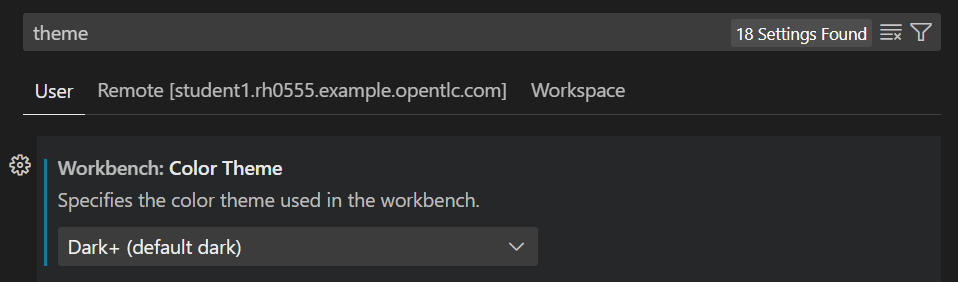

# Teil 1 - Vorbereitung

Als erstes bereitest du dir deine Demo/Entwicklungsumgebung vor.

Du wirst mit einigen Tools aus einem typischen DevOps-Projekt in Kontakt kommen:

* [Ansible](https://github.com/ansible/ansible){ target=_blank }
* [Ansible Automation Platform](https://www.redhat.com/en/technologies/management/ansible){ target=_blank }
* [Git](https://git-scm.com/){ target=_blank } & [Github](https://github.com/){ target=_blank }
* [VS Code](https://code.visualstudio.com/){ target=_blank }

**Ansible** ist eine Open-Source-IT-Automatisierungs-Engine, welche die Provisionierung, das Config-Management, die Application Deployment, Orchestrierung und viele andere IT-Prozesse automatisiert.  
Die **Ansible Automation Platform** ist eine integrierte Lösung für den Einsatz von Ansible im Unternehmen. Die Plattform umfasst einen Controller mit  Webkonsole und REST-API, Execution Environments, Authentifizierung und RBAC, Logging und Auditing, Credential- und Inventory-Handling, sowie Workflows zur Modellierung und Ausführung der Automatisierung komplexer Prozesse.  
**Git** ist der de-facto Standard zur Versionskontrolle von Code und ist integraler Bestandteil jedes Software-getriebenen Projekts.  
**Visual Studio Code** (kurz VS Code) ist ein kostenloser Quelltext-Editor von Microsoft. Visual Studio Code ist plattformübergreifend für die Betriebssysteme Windows, macOS und Linux verfügbar und ermöglicht u.a. Syntaxhighlighting, Debugging, Autovervollständigung und Versionsverwaltung.

## 1 - Anmeldung Demoumgebung

Eine Demoumgebung ist bereitgestellt, ihr benötigt lediglich einen Laptop und Internetzugang.  

!!! note ""
    <figure markdown="span">
        Workshop URL: **[{{ workshop_url | default('Dein Trainer wird dir den passenden Link nennen!') }}]({{ workshop_url | default('https://timgrt.github.io/IaC-Workshop-Uni-DuE/') }}){ target=_blank }**  
        Workshop Passwort: **{{ workshop_password | default('Dein Trainer wird dir das Passwort nennen!') }}**
    </figure>

Gib deine E-Mail-Adresse ein (du bekommst keine Post, dies dient lediglich der Zuordnung zu den einzelnen Workshop-Instanzen) und das entsprechende Workshop-Passwort, du wirst auf eine Workshop-Übersichtsseite mit einigen Links weitergeleitet.

<figure markdown="span">
    { width='600px' }
</figure>

## 2 - Code-Editor vorbereiten

Um den *Code* (das Ansible Playbook) anzupassen, verwendest du VSCode (eine IDE = Integrated Developer Environment), dort ist alles installiert was du zur Programmierung brauchst.

Im Abschnitt "**2 - :material-microsoft-visual-studio-code: image Visual Studio Code**", nutze den Link zu "**Console URL**". Kopiere dir das Passwort, du musst es einmal im nächsten Tab eingeben.

<figure markdown="span">
    { width='600px' }
</figure>

Es wird ein VS Code Editor im Browser gestartet, warte bis er vollständig geladen ist.

!!! tip
    Die Demo-Umgebung ist eigentlich für einen kompletten Ansible Workshop gedacht! Du führst heute aber einige fortgeschrittene Dinge aus, welche nicht Teil des ursprünglichen Workshops sind.

## 3 - Github Projekt klonen

Öffne ein Terminal. In der Menüleiste **Terminal** wählen und auf **New Terminal** klicken.  
Im Terminal/der Linux-Kommandozeile sicherstellen, dass du im *Home*-Verzeichnis bist:

```console
cd ~
```

Das Github-Projekt mit dem Automatisierungs-Playbook *klonen*, dazu das folgende Kommando ausführen:

```console
git clone https://github.com/TimGrt/IaC-Workshop-Uni-DuE.git
```

!!! tip
    Beim erstmaligen Einfügen (rechte Maustaste) ist eine Bestätigung notwendig:

    <figure markdown="span">
        
    </figure>

    Hier **Zulassen** wählen.

Es entsteht ein neuer Ordner, diesen über das Menüband **File** und **Open Folder...** öffnen (`/home/student/IaC-Workshop-Uni-DuE/`). Das Browser-Fenster aktualisiert sich, auf der linken Seite ist eine Ordner- und Dateiansicht zu sehen. Öffne wieder ein Terminal wie zuvor, um später die Automatisierung ausführen zu können.

!!! tip "Nützliche VScode Konfiguration"

    **Farbschema für Syntax-Highlighting anpassen**

    Die *Ansible* Extension unterstützt *Syntax-Highlighting* für Ansible-Inhalte. Je nach verwendeten *Theme* von VScode wird dies möglicherweise nicht korrekt angezeigt. Verwende das **Dark+ Theme**.  
    Klicke auf **File** in der oberen Menüleiste, gehe auf **Preferences**, **Theme** und klicke auf **Color Theme**.  
    Hier **Dark+ (default dark)** wählen.

    

    Die Warnung `Unable to write to user settings.` kann ignoriert werden.
