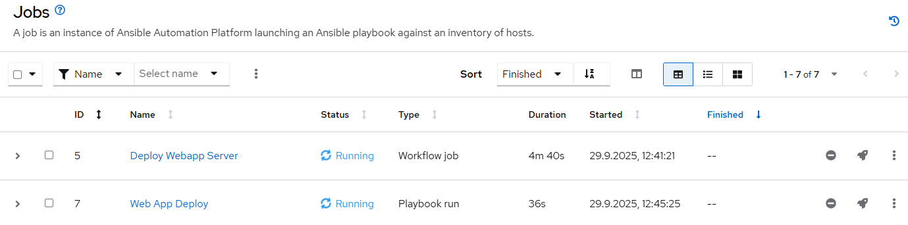
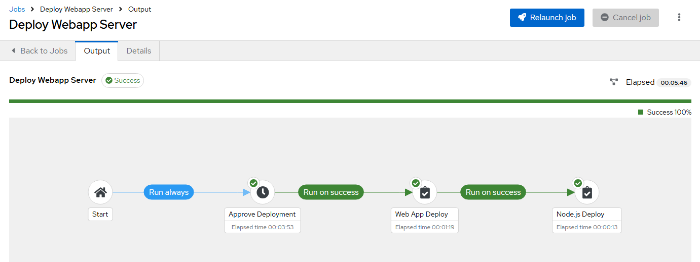

# Infrastructure as Code

Die Konfiguration der Automation Platform wird über ein Ansible Playbook angepasst, du kannst das Playbook mit dem folgenden Kommando im Terminal/auf der Kommandozeile ausführen:

```console
ansible-playbook playbook_controller_automation.yml
```

Bei den ersten Ausführungen wirst du mit einigen Fehlermeldung konfrontiert, es fehlen Dependencies, Credentials und auch ein Teil der Automatisierung an sich.

## 1 - Dependencies installieren

Wenn du versuchst das *Playbook* auszuführen, wirst du die folgende Fehlermeldung erhalten:

!!! failure

    ```console
    ERROR! Error loading module_defaults: could not resolve the module_defaults group awx.awx.controller
    ```

Es fehlen zur Ausführung notwendige *Dependencies*.  
Ansible Module werden in *Collections* hinterlegt (im Grunde eine spezielle Ordner-Struktur), sie können auf dem Controller mit einem CLI-Kommando installiert werden. Die Datei `requirements.yml` enthält den Namen der Collection, suche in der [Ansible Dokumentation nach dem passenden Kommando](https://docs.ansible.com/ansible/latest/collections_guide/collections_installing.html#install-multiple-collections-with-a-requirements-file){ target=_blank } und führe es aus.

??? tip "Hilfe nötig?"

    Die fehlende Collection mit folgendem Kommando installieren:

    ```console
    ansible-galaxy collection install -r requirements.yml
    ```

    Anschließend mit dem folgenden Kommando prüfen:

    ```console
    ansible-galaxy collection list
    ```

!!! question "Alles erledigt?"

    * [x] Notwendige `awx.awx` Collection ist installiert.

## 2 - Credentials exportieren

Um die AAP automatisieren zu können, muss sich das Playbook bei der Ausführung an der API anmelden, die notwendigen Credentials werden als *Umgebungsvariablen* übergeben. Die folgenden drei Variablen müssen definiert werden:

* `CONTROLLER_HOST`
* `CONTROLLER_USERNAME`
* `CONTROLLER_PASSWORD`

Die Umgebungsvariablen werden auf der Kommandozeile mit dem `export` Kommando übergeben, *Key* und *Value* werden durch ein Gleichzeichen (`=`) getrennt.

```console
export CONTROLLER_USERNAME=admin
```

**Exportiere alle drei Variablen.**  
Nutze die **[Werte aus der Workshop-Übersichtsseite]({{ workshop_url | default('https://timgrt.github.io/IaC-Workshop-Uni-DuE/') }}){ target=_blank }**, für die Variable `CONTROLLER_HOST` die URL des Red Hat Ansible Automation Controller (Abschnitt 3) verwenden.

Mit dem folgenden Kommando kannst du prüfen ob die Variablen erfolgreich exportiert wurden:

```console
env | grep CONTROLLER
```

!!! question "Alles erledigt?"

    * [x] AAP-API Credentials als Umgebungsvariablen exportiert (`CONTROLLER_HOST`, `CONTROLLER_USERNAME`, `CONTROLLER_PASSWORD`)

## 3 - Automatisierung anpassen/vervollständigen

Die Automatisierung ist unvollständig, wenn du das Playbook erneut ausführst, wird versucht ein Job-Template zu erstellen, welches auf ein nicht-existentes *Project* verweist.

!!! failure

    ```console
    Request to /api/v2/projects/?name=Git+Repository+with+Ops+Playbooks returned 0 items, expected 1
    ```

Ein *Project* in der AAP zeigt auf ein *Git-Repository*, es enthält allen *Code* für die Automatisierung.  
Die AAP zieht sich den Code aus diesem und sorgt (durch die Auswahl einer Option) dafür, dass vor jeder Ausführung der Automatisierung der aktuellste Stand geladen wird.

**Ein Ansible-Playbook besteht aus einer Liste an *Tasks*, du musst die fehlenden Tasks hinzufügen!**  
Klicke links im *File Explorer* auf die Datei `playbook_controller_automation.yml`, ab Zeile 23 sind die einzelnen *Tasks* (Schritte/Aufgaben) beschrieben, um den AAP Controller in den gewünschten Zielzustand zu versetzen.

!!! example ""

    
    ```yaml title="playbook_controller_automation.yml"
    ---
    - name: Prepare Automation Controller # (1)!
      hosts: localhost # (2)!
      connection: local
      module_defaults: # (3)!
        group/awx.awx.controller:
          controller_host: "{{ lookup('env', 'CONTROLLER_HOST') }}"
          controller_username: "{{ lookup('env', 'CONTROLLER_USERNAME') }}"
          controller_password: "{{ lookup('env', 'CONTROLLER_PASSWORD') }}"
      pre_tasks: # (4)!
        - name: Ensure required connection variables are defined
          ansible.builtin.assert:
            that:
              - lookup('env', 'CONTROLLER_HOST') is defined
              - lookup('env', 'CONTROLLER_HOST') | length > 0
              - lookup('env', 'CONTROLLER_USERNAME') is defined
              - lookup('env', 'CONTROLLER_USERNAME') | length > 0
              - lookup('env', 'CONTROLLER_PASSWORD') is defined
              - lookup('env', 'CONTROLLER_PASSWORD') | length > 0
            quiet: true
            fail_msg: "Variables for accessing Automation controller are missing! Export the variables."
      tasks: # (5)!
        - name: Ensure all hosts from web group are enabled
          awx.awx.host:
            name: "{{ item }}"
            inventory: Workshop Inventory
            enabled: true
            validate_certs: true
          loop:
            - node1
            - node2
            - node3
    # ... most tasks are cut for readability...
    ```
    

    1. Der Name des Playbooks, wird auf der CLI bei der Ausführung ausgegeben.
    2. Das Ziel der Automatisierung, standartmäßig kommuniziert Ansible per SSH. Da wir eine API ansprechen wollen, können wir gegen `localhost` mit der Verbindungsmethode `local` ausführen.
    3. Einige Standart-Parameter welche **alle** Module der `awx.awx` Collection bekommen sollen. In diesem Fall sind es die Authentifizierungs-Parameter, in jedem Task wird ein neuer API-Call zur AAP gemacht.
    4. Eine Liste an Tasks (hier nur ein einzelner), welche definitiv vor allen anderen laufen sollen. In diesem Fall wird eine Prüfung der Umgebungsvariablen gemacht, sollten sie fehlen, wird eine *sprechende* Fehlermeldung ausgeben.
    5. **Ab hier startet die eigentliche Automatisierung der AAP!** In dieser Liste (im YAML-Format beginnt jedes Listenelement mit `-`) müssen alle Tasks in der richtigen Reihenfolge aufgeführt werden.

Suche in der [Ansible Dokumentation](https://docs.ansible.com/ansible/latest/collections/awx/awx/index.html#modules){ target=_blank } nach dem passenden *Modul* zur Erstellung eines *Projects*.  

!!! tip
    Nutze die *Examples* (Beispiele) auf der Dokumentations-Seite des Moduls, du kannst ein Beispiel kopieren und einfügen, anschließend passt du die Parameter an und fügst fehlende Parameter hinzu.

Du musst sowohl das Project mit dem Operations-Content, als auch das Project mit dem Development-Content hinzufügen (**insgesamt also zwei Tasks**).


| Key                    | Value                                              |
| ---------------------- | -------------------------------------------------- |
| `name`                 | `Add project with playbooks for Ops workloads`     |
| `default_environment`  | `Default execution environment`                    |
| `scm_type`             | `git`                                              |
| `scm_url`              | `https://github.com/ansible/workshop-examples.git` |
| `scm_branch`           | `webops`                                           |
| `scm_update_on_launch` | `true`                                             |
| `scm_delete_on_update` | `true`                                             |
| `scm_clean`            | `true`                                             |
| `state`                | `present`                                          |

| Key                    | Value                                              |
| ---------------------- | -------------------------------------------------- |
| `name`                 | `Add project with playbooks for Dev workloads`     |
| `default_environment`  | `Default execution environment`                    |
| `scm_type`             | `git`                                              |
| `scm_url`              | `https://github.com/ansible/workshop-examples.git` |
| `scm_branch`           | `webdev`                                           |
| `scm_update_on_launch` | `true`                                             |
| `scm_delete_on_update` | `true`                                             |
| `scm_clean`            | `true`                                             |
| `state`                | `present`                                          |

!!! warning
    **Ein Ansible-Playbook wird sequentiell abgearbeitet, die Reihenfolge ist entscheidend!**  
    Füge die Tasks hinter dem Task `Ensure all hosts from web group are enabled`, aber vor dem Task `Create job template for infrastructure setup as Ops workload` ein.  
    Playbooks sind im YAML-Format geschrieben, hier kommt es auf die passende **Einrückung** an, **alle Tasks müssen auf der gleichen Ebene starten!**

??? tip "Hilfe nötig?"
    Die folgenden beiden Tasks fügen die notwendigen *Project*-Objekte hinzu:

    
    ```yaml
    - name: Add project with playbooks for Ops workloads
      awx.awx.project:
        name: Git Repository with Ops Playbooks
        default_environment: Default execution environment
        scm_type: git
        scm_url: https://github.com/ansible/workshop-examples.git
        scm_branch: webops
        scm_update_on_launch: true
        scm_delete_on_update: true
        scm_clean: true
        state: present

    - name: Add project with playbooks for Dev workloads
      awx.awx.project:
        name: Git Repository with Dev Playbooks
        default_environment: Default execution environment
        scm_type: git
        scm_url: https://github.com/ansible/workshop-examples.git
        scm_branch: webdev
        scm_update_on_launch: true
        scm_delete_on_update: true
        scm_clean: true
        state: present
    ```
    

    ??? example "Gesamtes Playbook"
        
        ```yaml
        ---
        - name: Prepare Automation Controller
          hosts: localhost
          connection: local
          module_defaults:
            group/awx.awx.controller:
              controller_host: "{{ lookup('env', 'CONTROLLER_HOST') }}"
              controller_username: "{{ lookup('env', 'CONTROLLER_USERNAME') }}"
              controller_password: "{{ lookup('env', 'CONTROLLER_PASSWORD') }}"
          pre_tasks:
            - name: Ensure required connection variables are defined
              ansible.builtin.assert:
                that:
                  - lookup('env', 'CONTROLLER_HOST') is defined
                  - lookup('env', 'CONTROLLER_HOST') | length > 0
                  - lookup('env', 'CONTROLLER_USERNAME') is defined
                  - lookup('env', 'CONTROLLER_USERNAME') | length > 0
                  - lookup('env', 'CONTROLLER_PASSWORD') is defined
                  - lookup('env', 'CONTROLLER_PASSWORD') | length > 0
                quiet: true
                fail_msg: "Variables for accessing Automation controller are missing! Export the variables."
          tasks:
            - name: Ensure all hosts from web group are enabled
              awx.awx.host:
                name: "{{ item }}"
                inventory: Workshop Inventory
                enabled: true
                validate_certs: true
              loop:
                - node1
                - node2
                - node3

            - name: Add project with playbooks for Ops workloads
              awx.awx.project:
                name: Git Repository with Ops Playbooks
                default_environment: Default execution environment
                scm_type: git
                scm_url: https://github.com/ansible/workshop-examples.git
                scm_branch: webops
                scm_update_on_launch: true
                scm_delete_on_update: true
                scm_clean: true
                state: present

            - name: Add project with playbooks for Dev workloads
              awx.awx.project:
                name: Git Repository with Dev Playbooks
                default_environment: Default execution environment
                scm_type: git
                scm_url: https://github.com/ansible/workshop-examples.git
                scm_branch: webdev
                scm_update_on_launch: true
                scm_delete_on_update: true
                scm_clean: true
                state: present

            - name: Create job template for infrastructure setup as Ops workload
              awx.awx.job_template:
                name: Web App Deploy
                job_type: run
                inventory: Workshop Inventory
                project: Git Repository with Ops Playbooks
                execution_environment: Default execution environment
                playbook: rhel/webops/web_infrastructure.yml
                credentials:
                  - Workshop Credentials
                limit: web
                become_enabled: true

            - name: Create job template for infrastructure setup as Dev workload
              awx.awx.job_template:
                name: Node.js Deploy
                job_type: run
                inventory: Workshop Inventory
                project: Git Repository with Ops Playbooks
                execution_environment: Default execution environment
                playbook: rhel/webdev/install_node_app.yml
                credentials:
                  - Workshop Credentials
                limit: web
                become_enabled: true

            - name: Create DevOps workflow for infrastructure setup and Nginx deployment
              awx.awx.workflow_job_template:
                name: Deploy Webapp Server
                destroy_current_nodes: true
                workflow_nodes:
                  - identifier: Approve Deployment
                    unified_job_template:
                      name: Approve Deployment
                      type: workflow_approval
                    related:
                      success_nodes:
                        - identifier: Web App Deploy
                  - identifier: Web App Deploy
                    unified_job_template:
                      name: Web App Deploy
                      type: job_template
                    related:
                      success_nodes:
                        - identifier: Node.js Deploy
                  - identifier: Node.js Deploy
                    unified_job_template:
                      name: Node.js Deploy
                      type: job_template

            - name: Launch workflow
              awx.awx.workflow_launch:
                workflow_template: Deploy Webapp Server
                wait: false

        ```
        

!!! question "Alles erledigt?"

    * [x] Passendes Modul aus der Dokumentation identifiziert
    * [x] Task für Ops-Content Project hinzugefügt
    * [x] Task für Dev-Content Project hinzugefügt

## 4 - Automatisierung ausführen

Sobald alles vollständig ist, kannst du die Automatisierung ausführen. Im Terminal wieder das folgende Kommando ausführen:

```console
ansible-playbook playbook_controller_automation.yml
```

Du wirst die einzelnen Task-Beschreibungen mit einem gelben *Changed*-Status sehen (wenn die Objekte angelegt/angepasst) werden, wenn alle Tasks erfolgreich abgearbeitet sind endet der Playbook-Run mit einem *Play Recap*.

## 5 - Automatisierung bestätigen

Der Automatisierungs-Workflow erwartet (in unserem Fall) eine manuelle Bestätigung, diese kannst du über das Web-UI der AAP ausführen.  
Logge dich auf dem Controller der Ansible Automation Platform ein, nutze den Link **[für den AAP Controller von der Workshop-Übersichtsseite]({{ workshop_url | default('https://timgrt.github.io/IaC-Workshop-Uni-DuE/') }}){ target=_blank }**.

Im Controller-UI, klicke links auf **Workflow Approvals**. Bestätige die Ausführung mit :thumbsup:.

<figure markdown="span">
  
</figure>

Anschließend kannst du auf den Workflow Job klicken (im Screenshot `3 - Deploy Webapp Server`), es öffnet sich eine Ansicht mit den einzelnen Workflow-Steps. Ebenfalls kannst du im linken Menü auf **Jobs** klicken und dort den Workflow Job auswählen.

<figure markdown="span">
  
</figure>

Nach einer Weile ist der Workflow beendet, es wurden neue Server provisioniert, ein Grundkonfiguration wurde ausgebracht und anschließend ein *nginx*-Webserver gestartet.

<figure markdown="span">
  
</figure>
