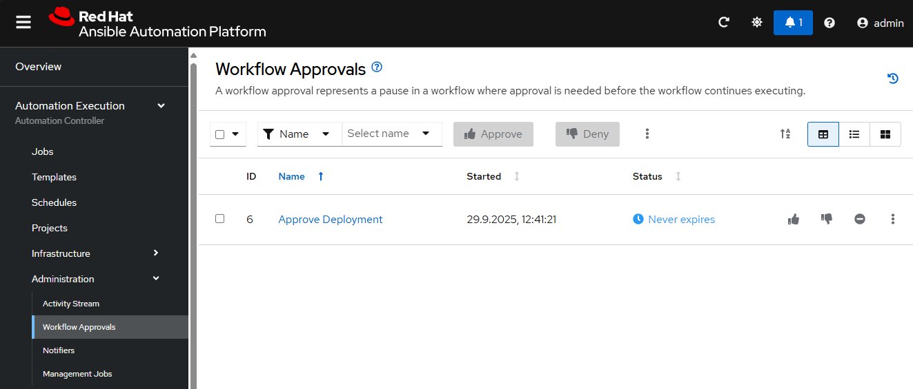

# *Operations*

Ab hier übernimmt eine andere *Abteilung* bzw. ein anderer *Verantwortungsbereich*, der **Ops**-Teil des **DevOps**-Workflows.

## 1 - Automatisierung bestätigen

Der Automatisierungs-Workflow erwartet (in unserem Fall) eine **manuelle Bestätigung**, diese kannst du über das Web-UI der AAP ausführen.  
Ein *Entwickler* (*Developer*) hat diese Berechtigung nicht!  

!!! success
    Logge dich auf dem Controller der Ansible Automation Platform ein, nutze den Link **[für den AAP Controller von der Workshop-Übersichtsseite]({{ workshop_url | default('https://timgrt.github.io/IaC-Demo/') }}){ target=_blank }**.

Im Controller-UI, klicke links auf **Workflow Approvals**. Bestätige die Ausführung mit :thumbsup:.

<figure markdown="span">
  
</figure>

Im linken Menü auf **Automation Execution &rarr; Jobs** klicken und dort den Workflow Job auswählen (auf `Deploy Webapp Server` klicken).

<figure markdown="span">
  
</figure>

!!! success
    Nach einer Weile ist der Workflow beendet, **es wurden neue Server provisioniert, eine Grundkonfiguration wurde ausgebracht, ein *Apache*-Webserver gestartet und anschließend ein *Node.js*-Skript ausgeführt.**.

<figure markdown="span">
  
</figure>

Ab sofort kann der **Betrieb** (*Operations*) den Automatisierungs-Workflow zur Bereitstellung der Infrastruktur und der Grundkonfiguration **immer wieder** ausführen, dank des von den **Entwicklern** (*Development*) erstellten Automatisierungs-Code.

!!! quote ""

    **:checkered_flag: - Geschafft! Hier gehts zu einem [kurzen Recap!](recap.md)**
